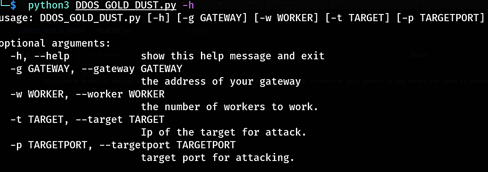
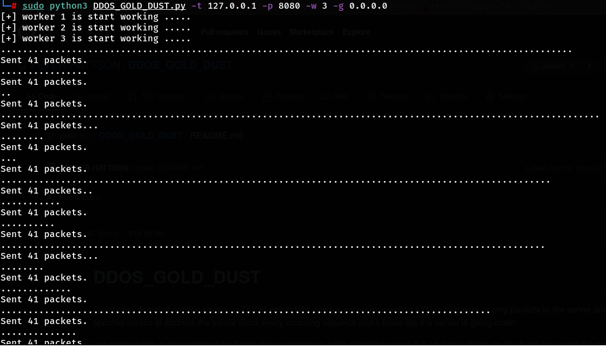

# DDOS_GOLD_DUST
Distributed denial of service known as DDOS which take down a server by sending SYN or fragment or ping packets to the server and casue of spoofed source ip address the server block every incoming requests and it looks like the server is going down

use proxychains or proxychains4 for being more anonymous while attacking cause it is an illegal attack on site 
Note: for runing the program you need the root permission
use:
  sudo proxycahins4 python3 DDOS_GOLD_DUST.py -g 0.0.0.0 -w 100 -t <your target site ip address A1> -p <80 or 443 or 8080 or any port it get the requests> 
    A1 >> use nslookup and site address to get it ip address
    you can use nmap + proxychains4 for finding the open ports on your target 
    
 the program environment : 
 
 program whlie working : 
 
 
    
    
